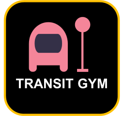

# Project website for TransitGym

*TransitGym is a prjocet developed for promoting transit operation with machine learning, especially on transit control based on multi-agent reinforcement learning*

