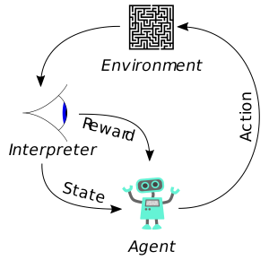

# Introduction

The advanced artifical intelligience (AI) research has opened a new door for many real world applications. 
One of the most exciting breakthrough is on reinforcement learning (RL) based techniques, which enable
agents to gain intelligient decision making abiltiy to deal with real-world tasks. 
Within the scheme of RL, the agents draws a trajectory from the environment by recursively taking an action
and observing a new states then collects rewards from the trajectory. RL allows agents to learn from this kind of interaction to gain maximum cumulative reward.

||
|:--:| 
| *RL diagram from wiki* |

The contrable apparatues in intelligient transportation system (ITS) appear in a vast number and are distributed in a wide
geographic area, which provides a promising research and application area to develop RL techniques.
In this project, we want to demonstrate the performance of RL based techniques in transit control domain.
In particular we want to advaocate the potential of multi-agent reinforcement learning (MARL) to improve the efficiency of transit system.

## Bus bunching
Public transport has been considered the most critical component in sustainable urban transportation. Providing reliable and efficient services to meet the increasing transit demand has become a major challenge faced by public transit operators. However, in real-world operations, the great uncertainties in traffic condition and dwell time often make bus services unstable.

Bus bunching has become a common phenomenon in the operation of high-frequency bus services. For a bus service, vehicles essentially leave the departure terminal with a regular frequency/headway (e.g., every 10 min) based on the timetable. If a bus is slightly delayed on the route, it will likely encounter more waiting passengers at the next bus stop, and then the dwell time serving boarding/alighting passengers will also increase. As a result, the delayed bus will be further delayed, and the following bus will become faster due to fewer waiting passengers and shorter dwell time; eventually, two or even more buses will bunch together and travel as a group.

Bus bunching has two major negative effects on rider experience: first, passengers will suffer from unnecessarily long waiting times with no buses coming before seeing a covey of buses arriving the same time; second, bus bunching also leads to imbalanced occupancy, since the leading bus in a group will take the majority of the waiting passengers and the others will take fewer remaining ones. Overall, bus bunching is a pressing issue to be addressed that undermines the reliability and efficiency of transit services. In general, the severity of bus bunching increases with the service length, with downstream passengers usually suffering more than upstream passengers.  

- Here is an [lovely example](https://setosa.io/bus/) by [Lewis Lehe](https://twitter.com/lewislehe). 

- Here is the [Visualization of bus holding control](./vis.html). To maintain regular headway among buses in the transit system is very similar
to the autonomous control to stablize traffic flow as researched by [FLOW](https://flow-project.github.io/), but our problem can be more complicated since there is not only uncertainty from agents (i.e., buses) but also from the
bus stops, where the passenger demand could be a significant factor affecting the performance of the system. 
